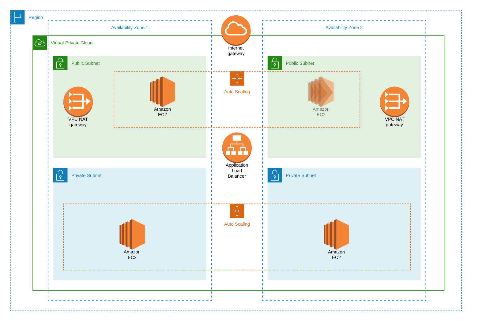

# Deploy a highly available web application using CloudFormation

## Architecture Diagram



## Instructions
To deploy the application on AWS, run the following command:

```
make deploy
```

## Using Bastion to access Application instances

From the EC2 console, navigate to Auto Scaling groups and find the Bastion launch configuration for your stack. Edit the launch configuration and set the desired instances to 1. Press Save and the Bastion instance will be created. Bastion is a gateway to your instances for enhanced security. 
